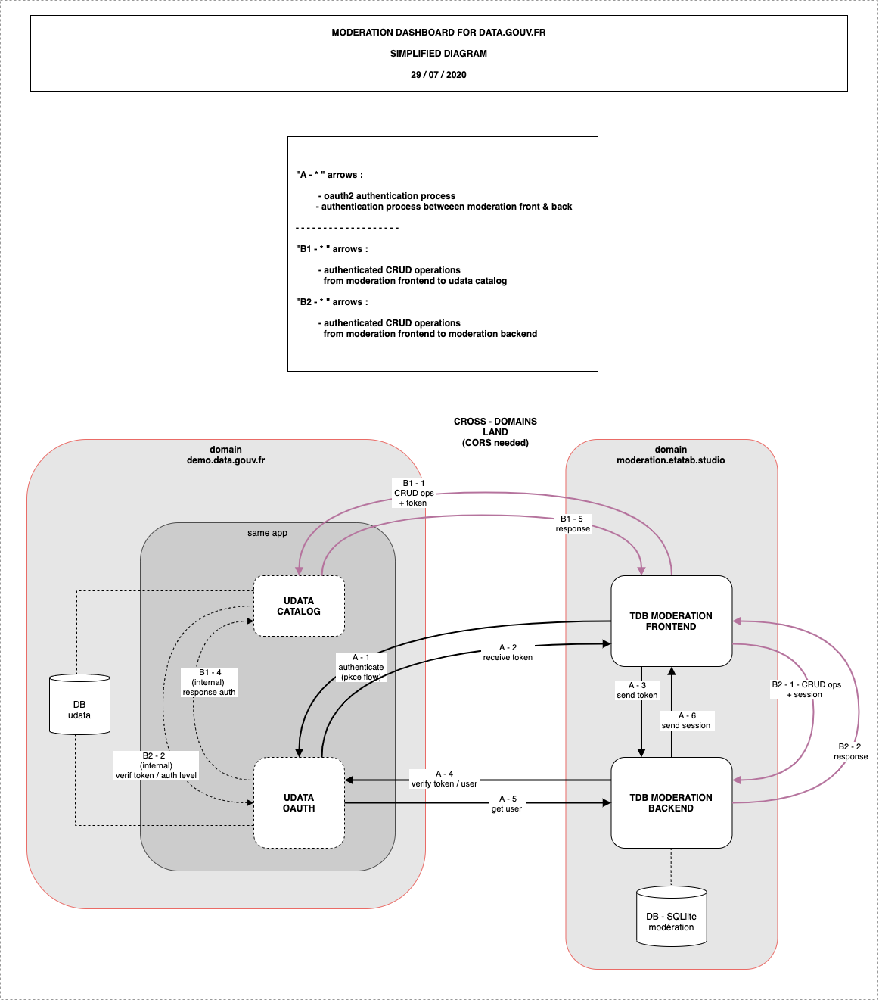

# MODERATION DASHBOARD FOR [DATAGOUV.FR](https://data.gouv.fr)

This project aims to provide an independant moderation tool for the data.gouv.fr platform. 

It should allow a datagouv's admin user to log in and do any of the actions it could previously do on the datagouv backoffice (CRUD), but also flag contents/resources/users/orga/... as potentially problematic. Doing so the datagouv moderators/admins team would be able to know which contents were already read, checked, approved by other moderators, and would be able to share the moderation tasks more efficiently amongst the team.

---

## Specs

The specs and other docs we used at pre-project phases are the following :

- pad specs & iterations : https://pad.incubateur.net/-_ELVbxhR2GHZ2-vNDwNgg?both
- pad needs & goals : https://pad.incubateur.net/NFTUu7o-SO-162K7OHthWw
- complementary pad : https://pad.incubateur.net/1mOA5ArPRReAdhkdnoJJlg#
- issues pad : https://pad.incubateur.net/JZt6WQVyRoGQ55FpBZdTsg

The main goals for this tool are : 

- oauth authentication ;
- CRUD operations on udata collections ;
- detect & neutralize chained spams ;
- flag spammy contents ;
- watch trolling contents ;
- watch external links ;

The development of this dashboard will be iterative, starting with a minimalistic version... We will keep a changelog file on both backend and frontend to keep a trace of the main evolutions.

---
## Functional diagram



---
## Frontend : VueJS

### documentation - [in folder](./frontend/README.md)

### urls

- https://moderation.app.etalab.studio/
- [](https://app.netlify.com/sites/datagouv-tdb-moderation-demo/deploys)
 https://datagouv-tdb-moderation-demo.netlify.app/

### changelog - [in folder](./frontend/CHANGELOG.md)

### notes

- ...

---
## Backend : Python

### documentation - [in folder](./bbackend/README.md)

### urls

- https://moderation.app.etalab.studio/api

### changelog - [in folder](./backend/CHANGELOG.md)

### notes

- ...

---

### Development

Launch backend:

```
python3 -mvenv pyenv
. pyenv/bin/activate
cd backend
python cli.py init-db
FLASK_DEBUG=1 FLASK_APP=app flask run
```

Launch frontend:

```
cd frontend
yarn
yarn serve
```

The frontend is available on http://localhost:8080 and uses the API available at http://localhost:5000.

---

### Production (dokku)

This project uses two buildpacks, `node` and `python`, to build and install both frontend and backend.

On the dokku server, prepare the postgres database and create the app:

```
dokku apps:create simple-spa
dokku postgres:create simple-spa
dokku postgres:link simple-spa simple-spa
```

On local copy:

```
git remote add dokku dokku@{host}:simple-spa
git push dokku master
```

The deployment process will run `init-db` thanks to the Procfile.

Get a SSL certificate and redirect to https:

```
dokku letsencrypt simple-spa
```

:rocket: https://simple-spa.{host}/api

### Tweaks

- Use multiple buildpacks, cf `.buildpacks` file.
- Double `package.json`: node buildpack only works with a `package.json` at the root of the project. The root `package.json` "proxies" installation to the `frontend` dir through the `post-install` script. The first `yarn install` install dev dependencies w/ `production=false`, then runs the build in `frontend`, then installs again w/ `production=true` to prune dev dependencies (similar to what the buildpack should be doing on its own but doesn't because our frontend is in a subdirectory).
- `requirements.txt` is kept at the root of the project for the same reasons.
- `Procfile` uses `--chdir` for `gunicorn` and `package.json` uses `--cwd` for `yarn`.

## Initial setup

How this repo has been built (result is commited).

### frontend

```
yarn global add @vue/cli @vue/cli-service-global
vue create frontend
# vue features: vuex, router w/ history mode
```

```
rm -rf frontend/.git
git init
```

In `frontend/vue.config.js`:

```javascript
module.exports = {
  outputDir: '../dist',
  assetsDir: 'static'
}
```

```
cd frontend && yarn build
```

### backend

```
python3 -mvenv pyenv
. pyenv/bin/activate
mkdir backend && cd backend
# write code :-)
```

### Credits

Inspiration: https://github.com/oleg-agapov/flask-vue-spa

